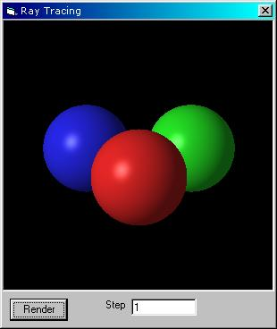



## RayTrace

### Description

This code generates a high quality ray traced image of three spheres. It's quite hard to understand, but it's full of comments. It's a lot of code, with good results. Please vote!
 
### More Info
 

             |
---                |---
**Submitted On**   |2000-12-03 14:00:18
**By**             |[Filip](https://github.com/Planet-Source-Code/PSCIndex/blob/master/ByAuthor/filip.md)
**Level**          |Advanced
**User Rating**    |4.6 (46 globes from 10 users)
**Compatibility**  |VB 5\.0, VB 6\.0
**Category**       |[Graphics](https://github.com/Planet-Source-Code/PSCIndex/blob/master/ByCategory/graphics__1-46.md)
**World**          |[Visual Basic](https://github.com/Planet-Source-Code/PSCIndex/blob/master/ByWorld/visual-basic.md)
**Archive File**   |[CODE\_UPLOAD122871232000\.zip](https://github.com/Planet-Source-Code/filip-raytrace__1-13285/archive/master.zip)

